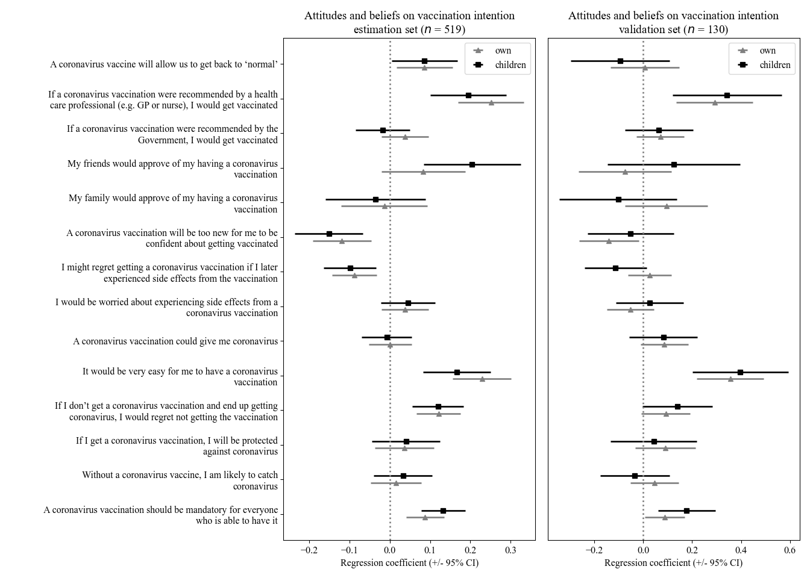
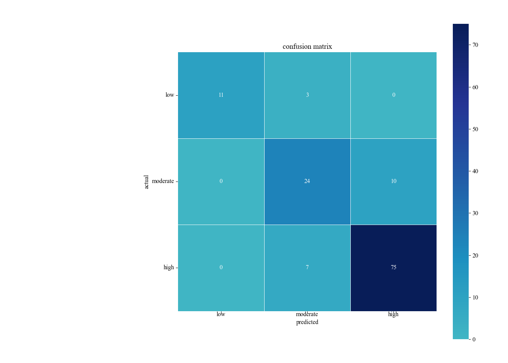
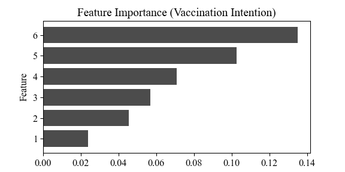

rmarkdown\_vaccination\_git
================
Nuno Fernandes
09/10/2021

### Import data & library

### setup wd

### read.csv

``` r
setwd("~/2021/Vacinação/Data/EXCEL")
covid2<-read.table("covid_15_03.csv",sep = ",")
```

### packages

``` r
packages <- c("dplyr", "tibble", "tidyr", "purrr", "FactoMineR", "ggplot2", "lm.beta", "olsrr", "neuralnet", "nnet", "caret", "NeuralNetTools", "reticulate","factoextra","lavaan", "FactoMineR", "lavaan", "extrafont", "rcompanion", "psy")

installed_packages <- packages %in% row.names(installed.packages())
if (any(installed_packages == FALSE)) {
  install.packages(packages[!installed.packages])
}

lapply(packages, library, character.only = TRUE)
```

## Exploratory analysis

### Graph Vaccination Intention

``` r
covid2[,60:117] <- as.numeric((unlist(covid2[,60:117])))

# NA removal
covid2 <- covid2[!is.na(covid2$V87), ]
covid2 <- covid2[!is.na(covid2$V60), ]
covid2 <- covid2[!covid2$V23==17, ]
covid2 <- covid2[!is.na(covid2$V88), ]

# children vaccination intention
covid2[,56:59] <- as.numeric((unlist(covid2[,56:59])))

covid2%>%
   mutate(intention_children = rowSums(cbind(V57, V58, V59), na.rm=T)) ->covid2

# vaccination col to long format
longdata2 = covid2 %>%
   gather("V56", "intention_children", key = Vaccination, value = Intention)

# rename value own & children
longdata2$Vaccination[longdata2$Vaccination=="V56"]<-"self"
longdata2$Vaccination[longdata2$Vaccination=="intention_children"]<-"children" 

# group by Intention & Vaccination
longdata2 %>%
  dplyr::group_by(Intention, Vaccination) %>%
summarise(Frequency = dplyr::n()) -> graph_mutate2
graph_mutate2$Frequency <- graph_mutate2$Frequency/649*100

# graph vaccination intention
graph_mutate2 %>% 
   mutate(Vaccination = as.factor(Vaccination)) %>% 
   ggplot(aes(x = Intention, y=Frequency, fill = Vaccination)) + 
  geom_bar(stat="identity", position=position_dodge()) + labs(x = "Intention to vaccinate", y= " Relative frequency (%)") +
   scale_x_discrete(expand = c(0, 0), name ="Intention of having the COVID-19 vaccine", 
                    limits=c("1","2","3","4","5","6","7")) +  geom_text(aes(label=sprintf("%1.1f%%", Frequency)), position = position_dodge(0.9),
                                                                        vjust = -0.1, size = 3) + scale_y_continuous(expand = c(0, 0), breaks = c(0,10,20,30,40,50,60,70))+
  coord_cartesian(ylim=c(0, 70)) +  theme_bw() +
  theme_minimal() +  theme(panel.grid.minor.y = element_blank(),
panel.grid.minor.x = element_blank(),panel.grid.major.x = element_blank() ) + theme(axis.line.x = element_line(colour = 'black', size=0.5, linetype='solid'),
                                               axis.line.y = element_line(colour = 'black', size=0.5, linetype='solid')) +
theme(text=element_text(family="Times New Roman", size=12)) +  theme(axis.text = element_text(size = 12),
    axis.text.y = element_text(color = "black"), axis.text.x = element_text(color = "black")) + theme(plot.margin = unit(c(1,3,1,1), "cm")) + scale_fill_grey() + theme(panel.grid.major = element_blank())
```

<!-- -->

### Graph Vaccination Concerns

``` r
covid2[,118:123]<- as.numeric(unlist(covid2[,118:123]))

# matrix concerns_vaccine
concerns_vaccine <- matrix(c(sum(covid2$V119, na.rm = T), sum(covid2$V118, na.rm = T), sum(covid2$V120, na.rm = T), sum(covid2$V121, na.rm = T), sum(covid2$V122, na.rm = T)), ncol=5, byrow=TRUE)

# data_concerns to data.frame 
data_concerns <-as.data.frame(concerns_vaccine)

# concerns to long format
longdata4 = data_concerns %>%
  gather("V1", "V2", "V3","V4","V5", key = Concerns, value = Frequency)

longdata4$Frequency <- round(longdata4$Frequency/649*100, digits = 1)

# revalue concerns
longdata4$Concerns[longdata4$Concerns=="V1"]<-"record time"
longdata4$Concerns[longdata4$Concerns=="V2"]<-"side effects"
longdata4$Concerns[longdata4$Concerns=="V3"]<-"risk group"
longdata4$Concerns[longdata4$Concerns=="V4"]<-"ineffective"
longdata4$Concerns[longdata4$Concerns=="V5"]<-"microchip"

#concerns as factor 
longdata4$Concerns<-as.factor(longdata4$Concerns)
longdata4$Concerns <- factor(c("record time", "side effects", "risk group", "ineffective", "microchip"),
                levels = c("record time", "side effects", "risk group", "ineffective", "microchip"))

# concerns graph
ggplot(data=longdata4, aes(x=Concerns, y=Frequency)) +
  geom_bar(stat="identity")+ coord_cartesian(ylim = c(0, 70))+ 
  theme_minimal()  + theme(panel.grid.minor = element_blank()) +
scale_y_continuous(expand = c(0, 0), breaks = c(0,10,20,30,40,50,60,70))+
  coord_cartesian(ylim=c(0, 70)) + theme(panel.grid.major.y = element_blank(),
panel.grid.minor.y = element_blank() ) + theme(axis.line.x = element_line(colour = 'black', size=0.5, linetype='solid'),
                                               axis.line.y = element_line(colour = 'black', size=0.5, linetype='solid')) +
  geom_text(aes(label=sprintf("%1.1f%%", Frequency)), position = position_dodge(0.9),
                                                                        vjust = -0.1, size = 3) + labs(x = "Concerns", y= " Relative frequency (%)") +
  scale_x_discrete(expand = c(0, 0)) + theme(plot.margin = unit(c(5, 5, 5, 5), "mm")) + 
  theme(text=element_text(family="Times New Roman", size=12)) + theme(panel.grid.major = element_blank())
```

<!-- -->

### Coding variables

``` r
covid2$V2<-as.numeric(unlist(covid2$V2))

covid2$V21[covid2$V21==3]<-"male"
covid2$V21[covid2$V21==4]<-"female"
covid2$V21[covid2$V21==5]<- NA
covid2$V21<-as.factor(covid2$V21)

covid2$V23<-as.numeric(unlist(covid2$V23))

covid2$V25[covid2$V25==1]<-"aaprimary/basic"
covid2$V25[covid2$V25==2]<-"aaprimary/basic"
covid2$V25[covid2$V25==3]<-"aaprimary/basic"
covid2$V25[covid2$V25==4]<-"high school"
covid2$V25[covid2$V25==5]<-"academic"
covid2$V25[covid2$V25==6]<-"academic"
covid2$V25[covid2$V25==7]<-"academic"
covid2$V25[covid2$V25==8]<- NA
covid2$V25<-as.factor(covid2$V25)

covid2$V27[covid2$V27==1]<-"rural"
covid2$V27[covid2$V27==2]<-"urban"
covid2$V27<-as.factor(covid2$V27)

covid2$V28[covid2$V28==1]<-"yes"
covid2$V28[covid2$V28==2]<-"no"
covid2$V28<-as.factor(covid2$V28)

covid2$V29<-as.numeric(unlist(covid2$V29))

covid2$V30[covid2$V30==1]<-"working"
covid2$V30[covid2$V30==2]<-"unemployed"
covid2$V30[covid2$V30==3]<-"retired"
covid2$V30[covid2$V30==5]<-"student"
covid2$V30[covid2$V30==6]<-"working"
covid2$V30[covid2$V30==7]<- NA
covid2$V30<-as.factor(covid2$V30)

covid2$V32[covid2$V32==1]<-"yes"
covid2$V32[covid2$V32==2]<-"no"
covid2$V32<-as.factor(covid2$V32)

covid2$V48<-as.numeric(unlist(covid2$V48))

covid2$V49[covid2$V49==1]<-"yes"
covid2$V49[covid2$V49==2]<-"no"
covid2$V49<-as.factor(covid2$V49)

covid2$V51<-as.numeric(unlist(covid2$V51))

covid2$V54<-as.numeric(unlist(covid2$V54))

covid2$V55[covid2$V55==1]<-"no"
covid2$V55[covid2$V55==2]<-"no"
covid2$V55[covid2$V55==3]<-"yes"
covid2$V55[covid2$V55==4]<-"yes"
covid2$V55<-as.factor(covid2$V55)
```

### Dimensionality reduction - Scales

### PCA COVID-19 scale

``` r
pca <- PCA(covid2[,60:67], graph = F)

get_eig(pca)
```

    ##       eigenvalue variance.percent cumulative.variance.percent
    ## Dim.1  2.4022356        30.027945                    30.02795
    ## Dim.2  1.4786966        18.483707                    48.51165
    ## Dim.3  1.0151921        12.689901                    61.20155
    ## Dim.4  0.8439997        10.549996                    71.75155
    ## Dim.5  0.7378624         9.223280                    80.97483
    ## Dim.6  0.6671026         8.338782                    89.31361
    ## Dim.7  0.5906292         7.382865                    96.69648
    ## Dim.8  0.2642818         3.303523                   100.00000

``` r
fviz_screeplot(pca, addlabels = TRUE, ylim = c(0, 50))
```

<!-- -->

``` r
var <- get_pca_var(pca)
fviz_pca_var(pca, col.var="contrib",
             gradient.cols = c("#00AFBB", "#E7B800", "#FC4E07"),
             repel = TRUE
)
```

<!-- -->

``` r
summary(pca,nbelements = 10, ncp = 3)
```

    ## 
    ## Call:
    ## PCA(X = covid2[, 60:67], graph = F) 
    ## 
    ## 
    ## Eigenvalues
    ##                        Dim.1   Dim.2   Dim.3   Dim.4   Dim.5   Dim.6   Dim.7
    ## Variance               2.402   1.479   1.015   0.844   0.738   0.667   0.591
    ## % of var.             30.028  18.484  12.690  10.550   9.223   8.339   7.383
    ## Cumulative % of var.  30.028  48.512  61.202  71.752  80.975  89.314  96.696
    ##                        Dim.8
    ## Variance               0.264
    ## % of var.              3.304
    ## Cumulative % of var. 100.000
    ## 
    ## Individuals (the 10 first)
    ##         Dist    Dim.1    ctr   cos2    Dim.2    ctr   cos2    Dim.3    ctr
    ## 2   |  2.410 |  0.962  0.059  0.159 |  1.987  0.412  0.680 |  0.821  0.102
    ## 3   |  2.898 |  2.245  0.323  0.600 |  0.080  0.001  0.001 | -0.168  0.004
    ## 6   |  2.534 |  0.021  0.000  0.000 |  1.761  0.323  0.483 |  0.324  0.016
    ## 9   |  2.014 |  1.298  0.108  0.415 | -0.561  0.033  0.078 |  0.874  0.116
    ## 10  |  2.797 |  2.201  0.311  0.619 |  0.857  0.077  0.094 | -1.059  0.170
    ## 11  |  4.853 | -1.447  0.134  0.089 |  0.650  0.044  0.018 | -3.941  2.357
    ## 12  |  2.563 | -1.258  0.102  0.241 | -0.668  0.046  0.068 |  0.541  0.044
    ## 13  |  2.096 |  1.984  0.253  0.896 | -0.308  0.010  0.022 | -0.002  0.000
    ## 14  |  2.669 |  1.256  0.101  0.221 |  0.437  0.020  0.027 | -1.715  0.446
    ## 15  |  3.277 | -0.626  0.025  0.037 |  2.252  0.528  0.472 | -1.235  0.232
    ##       cos2  
    ## 2    0.116 |
    ## 3    0.003 |
    ## 6    0.016 |
    ## 9    0.188 |
    ## 10   0.143 |
    ## 11   0.659 |
    ## 12   0.045 |
    ## 13   0.000 |
    ## 14   0.413 |
    ## 15   0.142 |
    ## 
    ## Variables
    ##        Dim.1    ctr   cos2    Dim.2    ctr   cos2    Dim.3    ctr   cos2  
    ## V60 |  0.621 16.064  0.386 | -0.394 10.482  0.155 |  0.138  1.868  0.019 |
    ## V61 | -0.340  4.820  0.116 |  0.502 17.034  0.252 |  0.275  7.434  0.075 |
    ## V62 | -0.628 16.400  0.394 |  0.184  2.284  0.034 |  0.259  6.607  0.067 |
    ## V63 |  0.622 16.090  0.387 |  0.012  0.010  0.000 | -0.156  2.399  0.024 |
    ## V64 | -0.441  8.101  0.195 |  0.504 17.184  0.254 |  0.028  0.075  0.001 |
    ## V65 |  0.163  1.110  0.027 | -0.288  5.592  0.083 |  0.898 79.501  0.807 |
    ## V66 |  0.689 19.781  0.475 |  0.574 22.298  0.330 |  0.131  1.697  0.017 |
    ## V67 |  0.651 17.634  0.424 |  0.609 25.116  0.371 |  0.065  0.419  0.004 |

### CFA COVID-19 scale

``` r
model<-'
covid_threat=~V60 + V62 + V63 + V64
trust=~V66 + V67
covid_impact=~V65 + V61'

fit<- cfa(model, data=covid2)
summary(fit, fit.measures=T,standardized=T)
```

    ## lavaan 0.6-8 ended normally after 60 iterations
    ## 
    ##   Estimator                                         ML
    ##   Optimization method                           NLMINB
    ##   Number of model parameters                        19
    ##                                                       
    ##   Number of observations                           649
    ##                                                       
    ## Model Test User Model:
    ##                                                       
    ##   Test statistic                                72.992
    ##   Degrees of freedom                                17
    ##   P-value (Chi-square)                           0.000
    ## 
    ## Model Test Baseline Model:
    ## 
    ##   Test statistic                               943.049
    ##   Degrees of freedom                                28
    ##   P-value                                        0.000
    ## 
    ## User Model versus Baseline Model:
    ## 
    ##   Comparative Fit Index (CFI)                    0.939
    ##   Tucker-Lewis Index (TLI)                       0.899
    ## 
    ## Loglikelihood and Information Criteria:
    ## 
    ##   Loglikelihood user model (H0)              -8838.469
    ##   Loglikelihood unrestricted model (H1)      -8801.973
    ##                                                       
    ##   Akaike (AIC)                               17714.938
    ##   Bayesian (BIC)                             17799.971
    ##   Sample-size adjusted Bayesian (BIC)        17739.647
    ## 
    ## Root Mean Square Error of Approximation:
    ## 
    ##   RMSEA                                          0.071
    ##   90 Percent confidence interval - lower         0.055
    ##   90 Percent confidence interval - upper         0.088
    ##   P-value RMSEA <= 0.05                          0.017
    ## 
    ## Standardized Root Mean Square Residual:
    ## 
    ##   SRMR                                           0.050
    ## 
    ## Parameter Estimates:
    ## 
    ##   Standard errors                             Standard
    ##   Information                                 Expected
    ##   Information saturated (h1) model          Structured
    ## 
    ## Latent Variables:
    ##                    Estimate  Std.Err  z-value  P(>|z|)   Std.lv  Std.all
    ##   covid_threat =~                                                       
    ##     V60               1.000                               0.870    0.618
    ##     V62              -1.182    0.128   -9.200    0.000   -1.028   -0.557
    ##     V63               0.458    0.053    8.706    0.000    0.399    0.504
    ##     V64              -0.683    0.087   -7.822    0.000   -0.594   -0.430
    ##   trust =~                                                              
    ##     V66               1.000                               1.471    0.903
    ##     V67               0.994    0.104    9.574    0.000    1.462    0.805
    ##   covid_impact =~                                                       
    ##     V65               1.000                               0.161    0.121
    ##     V61              -2.780    0.871   -3.193    0.001   -0.448   -0.266
    ## 
    ## Covariances:
    ##                    Estimate  Std.Err  z-value  P(>|z|)   Std.lv  Std.all
    ##   covid_threat ~~                                                       
    ##     trust             0.522    0.079    6.612    0.000    0.408    0.408
    ##     covid_impact      0.196    0.058    3.358    0.001    1.401    1.401
    ##   trust ~~                                                              
    ##     covid_impact      0.029    0.036    0.813    0.416    0.122    0.122
    ## 
    ## Variances:
    ##                    Estimate  Std.Err  z-value  P(>|z|)   Std.lv  Std.all
    ##    .V60               1.223    0.099   12.402    0.000    1.223    0.618
    ##    .V62               2.343    0.168   13.928    0.000    2.343    0.689
    ##    .V63               0.467    0.031   14.954    0.000    0.467    0.746
    ##    .V64               1.558    0.097   15.994    0.000    1.558    0.815
    ##    .V66               0.488    0.217    2.250    0.024    0.488    0.184
    ##    .V67               1.159    0.222    5.216    0.000    1.159    0.352
    ##    .V65               1.760    0.102   17.215    0.000    1.760    0.985
    ##    .V61               2.633    0.275    9.584    0.000    2.633    0.929
    ##     covid_threat      0.757    0.112    6.744    0.000    1.000    1.000
    ##     trust             2.163    0.259    8.337    0.000    1.000    1.000
    ##     covid_impact      0.026    0.034    0.753    0.451    1.000    1.000

### coding COVID-19 scale dimensions

``` r
covid2 %>%
  rowwise %>%
  mutate(covid_threat = mean(c(V60, 8-V62, V63, 8-V64))) %>%
  mutate(trust = mean(c(V66, V67))) -> covid2 
  
covid2 %>%
  rowwise %>%
  mutate(covid_impact = mean(c(V65, 8-V61))) ->covid2
```

### alpha COVID-19 global

``` r
alpha_covid_threat <- covid2 %>% select(V60, V62, V63, V64, V66, V67, V65, V61)
alpha_covid_threat$V62<-8-alpha_covid_threat$V62
alpha_covid_threat$V64<-8-alpha_covid_threat$V64
alpha_covid_threat$V66<-8-alpha_covid_threat$V66
alpha_covid_threat$V67<-8-alpha_covid_threat$V67
alpha_covid_threat$V61<-8-alpha_covid_threat$V61

cronbach(alpha_covid_threat)
```

    ## $sample.size
    ## [1] 649
    ## 
    ## $number.of.items
    ## [1] 8
    ## 
    ## $alpha
    ## [1] 0.3665474

### alpha COVID-19 covid\_threat

``` r
alpha_covid_threat <- covid2 %>% select(V60, V62, V63, V64)
alpha_covid_threat$V62<-8-alpha_covid_threat$V62
alpha_covid_threat$V64<-8-alpha_covid_threat$V64
cronbach(alpha_covid_threat)
```

    ## $sample.size
    ## [1] 649
    ## 
    ## $number.of.items
    ## [1] 4
    ## 
    ## $alpha
    ## [1] 0.5773531

### alpha COVID-19 covid\_trust

``` r
alpha_covid_trust <- covid2 %>% select(V66, V67)

cronbach(alpha_covid_trust)
```

    ## $sample.size
    ## [1] 649
    ## 
    ## $number.of.items
    ## [1] 2
    ## 
    ## $alpha
    ## [1] 0.8391796

### alpha COVID-19 global

``` r
alpha_covid_impact <- covid2 %>% select(V65, V61)
alpha_covid_impact$V61<-8-alpha_covid_impact$V61


cronbach(alpha_covid_impact)
```

    ## $sample.size
    ## [1] 649
    ## 
    ## $number.of.items
    ## [1] 2
    ## 
    ## $alpha
    ## [1] 0.06063101

### PCA vaccine scale

``` r
pca <- PCA(covid2[,68:87], graph=F)

get_eig(pca)
```

    ##        eigenvalue variance.percent cumulative.variance.percent
    ## Dim.1   6.3960192       31.9800962                    31.98010
    ## Dim.2   1.8936801        9.4684003                    41.44850
    ## Dim.3   1.4234872        7.1174359                    48.56593
    ## Dim.4   1.3466117        6.7330584                    55.29899
    ## Dim.5   1.0354248        5.1771240                    60.47611
    ## Dim.6   0.9656257        4.8281285                    65.30424
    ## Dim.7   0.8570011        4.2850055                    69.58925
    ## Dim.8   0.7902319        3.9511593                    73.54041
    ## Dim.9   0.7011004        3.5055019                    77.04591
    ## Dim.10  0.6092650        3.0463248                    80.09223
    ## Dim.11  0.5837526        2.9187630                    83.01100
    ## Dim.12  0.5391384        2.6956922                    85.70669
    ## Dim.13  0.4825333        2.4126663                    88.11936
    ## Dim.14  0.4691926        2.3459632                    90.46532
    ## Dim.15  0.4256310        2.1281551                    92.59347
    ## Dim.16  0.4089712        2.0448559                    94.63833
    ## Dim.17  0.3244820        1.6224102                    96.26074
    ## Dim.18  0.2897644        1.4488218                    97.70956
    ## Dim.19  0.2722502        1.3612509                    99.07081
    ## Dim.20  0.1858373        0.9291866                   100.00000

``` r
fviz_screeplot(pca, addlabels = TRUE, ylim = c(0, 50))
```

<!-- -->

``` r
var <- get_pca_var(pca)

fviz_pca_var(pca, col.var="contrib",
             gradient.cols = c("#00AFBB", "#E7B800", "#FC4E07"),
             repel = TRUE 
)
```

<!-- -->

``` r
summary(pca,nbelements = 20, ncp = 4)
```

    ## 
    ## Call:
    ## PCA(X = covid2[, 68:87], graph = F) 
    ## 
    ## 
    ## Eigenvalues
    ##                        Dim.1   Dim.2   Dim.3   Dim.4   Dim.5   Dim.6   Dim.7
    ## Variance               6.396   1.894   1.423   1.347   1.035   0.966   0.857
    ## % of var.             31.980   9.468   7.117   6.733   5.177   4.828   4.285
    ## Cumulative % of var.  31.980  41.448  48.566  55.299  60.476  65.304  69.589
    ##                        Dim.8   Dim.9  Dim.10  Dim.11  Dim.12  Dim.13  Dim.14
    ## Variance               0.790   0.701   0.609   0.584   0.539   0.483   0.469
    ## % of var.              3.951   3.506   3.046   2.919   2.696   2.413   2.346
    ## Cumulative % of var.  73.540  77.046  80.092  83.011  85.707  88.119  90.465
    ##                       Dim.15  Dim.16  Dim.17  Dim.18  Dim.19  Dim.20
    ## Variance               0.426   0.409   0.324   0.290   0.272   0.186
    ## % of var.              2.128   2.045   1.622   1.449   1.361   0.929
    ## Cumulative % of var.  92.593  94.638  96.261  97.710  99.071 100.000
    ## 
    ## Individuals (the 20 first)
    ##         Dist    Dim.1    ctr   cos2    Dim.2    ctr   cos2    Dim.3    ctr
    ## 1   |  5.292 |  1.787  0.077  0.114 |  3.377  0.928  0.407 |  2.440  0.644
    ## 2   |  4.203 |  2.372  0.136  0.319 | -1.446  0.170  0.118 | -0.501  0.027
    ## 3   |  3.360 |  1.198  0.035  0.127 |  0.110  0.001  0.001 |  0.768  0.064
    ## 4   |  3.123 |  1.889  0.086  0.366 |  0.531  0.023  0.029 |  0.366  0.015
    ## 5   |  4.338 |  3.657  0.322  0.711 | -0.270  0.006  0.004 | -0.217  0.005
    ## 6   |  4.078 |  0.754  0.014  0.034 | -2.206  0.396  0.293 |  0.199  0.004
    ## 7   |  5.580 |  0.017  0.000  0.000 |  3.688  1.106  0.437 |  0.583  0.037
    ## 8   |  5.202 |  1.084  0.028  0.043 | -2.256  0.414  0.188 | -0.204  0.005
    ## 9   |  4.732 |  2.626  0.166  0.308 | -0.896  0.065  0.036 | -1.582  0.271
    ## 10  |  2.844 |  1.322  0.042  0.216 | -0.412  0.014  0.021 | -0.622  0.042
    ## 11  |  7.244 | -5.577  0.749  0.593 | -0.302  0.007  0.002 |  0.785  0.067
    ## 12  |  4.293 |  3.330  0.267  0.602 | -1.004  0.082  0.055 | -0.375  0.015
    ## 13  |  3.013 |  2.099  0.106  0.486 | -1.691  0.233  0.315 | -0.189  0.004
    ## 14  |  3.558 | -0.195  0.001  0.003 | -0.502  0.021  0.020 |  0.058  0.000
    ## 15  |  1.461 |  0.281  0.002  0.037 | -0.127  0.001  0.008 | -0.162  0.003
    ## 16  |  3.008 |  1.891  0.086  0.395 |  0.397  0.013  0.017 |  1.300  0.183
    ## 17  |  3.915 |  2.040  0.100  0.272 | -1.635  0.217  0.174 | -0.128  0.002
    ## 18  |  2.650 |  2.241  0.121  0.716 | -0.042  0.000  0.000 | -0.366  0.014
    ## 19  |  3.728 |  2.591  0.162  0.483 |  1.159  0.109  0.097 | -0.520  0.029
    ## 20  |  5.483 |  0.480  0.006  0.008 | -0.435  0.015  0.006 | -0.193  0.004
    ##       cos2    Dim.4    ctr   cos2  
    ## 1    0.213 |  1.627  0.303  0.094 |
    ## 2    0.014 |  0.621  0.044  0.022 |
    ## 3    0.052 |  0.410  0.019  0.015 |
    ## 4    0.014 |  1.309  0.196  0.176 |
    ## 5    0.002 | -0.900  0.093  0.043 |
    ## 6    0.002 | -1.106  0.140  0.074 |
    ## 7    0.011 | -1.145  0.150  0.042 |
    ## 8    0.002 |  0.059  0.000  0.000 |
    ## 9    0.112 |  0.514  0.030  0.012 |
    ## 10   0.048 |  0.692  0.055  0.059 |
    ## 11   0.012 | -0.308  0.011  0.002 |
    ## 12   0.008 | -0.018  0.000  0.000 |
    ## 13   0.004 |  0.377  0.016  0.016 |
    ## 14   0.000 |  0.844  0.082  0.056 |
    ## 15   0.012 | -0.272  0.008  0.035 |
    ## 16   0.187 |  0.306  0.011  0.010 |
    ## 17   0.001 |  1.255  0.180  0.103 |
    ## 18   0.019 |  0.307  0.011  0.013 |
    ## 19   0.019 |  0.151  0.003  0.002 |
    ## 20   0.001 |  0.753  0.065  0.019 |
    ## 
    ## Variables
    ##        Dim.1    ctr   cos2    Dim.2    ctr   cos2    Dim.3    ctr   cos2  
    ## V68 |  0.547  4.677  0.299 |  0.103  0.564  0.011 | -0.062  0.272  0.004 |
    ## V69 |  0.482  3.631  0.232 |  0.265  3.713  0.070 |  0.203  2.904  0.041 |
    ## V70 |  0.645  6.498  0.416 |  0.332  5.831  0.110 |  0.261  4.777  0.068 |
    ## V71 |  0.633  6.262  0.401 |  0.230  2.801  0.053 |  0.058  0.239  0.003 |
    ## V72 |  0.743  8.634  0.552 |  0.032  0.055  0.001 |  0.016  0.018  0.000 |
    ## V73 | -0.489  3.732  0.239 |  0.125  0.826  0.016 |  0.107  0.797  0.011 |
    ## V74 | -0.568  5.039  0.322 |  0.393  8.173  0.155 | -0.001  0.000  0.000 |
    ## V75 | -0.585  5.342  0.342 |  0.410  8.863  0.168 |  0.053  0.194  0.003 |
    ## V76 | -0.798  9.948  0.636 |  0.223  2.624  0.050 |  0.014  0.015  0.000 |
    ## V77 |  0.279  1.219  0.078 |  0.214  2.414  0.046 | -0.258  4.659  0.066 |
    ## V78 |  0.455  3.237  0.207 |  0.238  3.000  0.057 | -0.233  3.816  0.054 |
    ## V79 | -0.101  0.158  0.010 |  0.383  7.741  0.147 |  0.547 21.020  0.299 |
    ## V80 |  0.382  2.280  0.146 | -0.605 19.314  0.366 |  0.427 12.803  0.182 |
    ## V81 |  0.477  3.564  0.228 | -0.578 17.632  0.334 |  0.421 12.457  0.177 |
    ## V82 |  0.649  6.585  0.421 |  0.118  0.736  0.014 | -0.220  3.402  0.048 |
    ## V83 |  0.637  6.344  0.406 |  0.093  0.454  0.009 | -0.218  3.347  0.048 |
    ## V84 |  0.616  5.928  0.379 |  0.245  3.183  0.060 |  0.006  0.002  0.000 |
    ## V85 |  0.780  9.524  0.609 |  0.179  1.687  0.032 | -0.087  0.537  0.008 |
    ## V86 |  0.655  6.700  0.429 |  0.248  3.235  0.061 |  0.235  3.892  0.055 |
    ## V87 | -0.211  0.699  0.045 |  0.368  7.155  0.135 |  0.595 24.847  0.354 |
    ##      Dim.4    ctr   cos2  
    ## V68 -0.167  2.078  0.028 |
    ## V69 -0.073  0.392  0.005 |
    ## V70 -0.143  1.525  0.021 |
    ## V71 -0.139  1.444  0.019 |
    ## V72 -0.107  0.849  0.011 |
    ## V73  0.096  0.686  0.009 |
    ## V74  0.177  2.315  0.031 |
    ## V75  0.118  1.029  0.014 |
    ## V76  0.196  2.862  0.039 |
    ## V77  0.647 31.064  0.418 |
    ## V78  0.569 24.040  0.324 |
    ## V79  0.077  0.444  0.006 |
    ## V80  0.357  9.488  0.128 |
    ## V81  0.319  7.557  0.102 |
    ## V82  0.207  3.182  0.043 |
    ## V83  0.272  5.501  0.074 |
    ## V84 -0.121  1.094  0.015 |
    ## V85 -0.170  2.136  0.029 |
    ## V86 -0.039  0.113  0.002 |
    ## V87  0.172  2.201  0.030 |

### CFA vaccine scale

``` r
model<-'
beliefs_attitudes=~V68+V69+V70+V71+V72+V73+V74+V75+V76+V82+V83+V84+V85+V86
others_intention=~V77+V78
knowledge=~V80+V81
return_to_normal=~V79+V87'
fit<- cfa(model, data=covid2)
summary(fit, fit.measures=T,standardized=T)
```

    ## lavaan 0.6-8 ended normally after 80 iterations
    ## 
    ##   Estimator                                         ML
    ##   Optimization method                           NLMINB
    ##   Number of model parameters                        46
    ##                                                       
    ##   Number of observations                           649
    ##                                                       
    ## Model Test User Model:
    ##                                                       
    ##   Test statistic                              1055.864
    ##   Degrees of freedom                               164
    ##   P-value (Chi-square)                           0.000
    ## 
    ## Model Test Baseline Model:
    ## 
    ##   Test statistic                              5083.974
    ##   Degrees of freedom                               190
    ##   P-value                                        0.000
    ## 
    ## User Model versus Baseline Model:
    ## 
    ##   Comparative Fit Index (CFI)                    0.818
    ##   Tucker-Lewis Index (TLI)                       0.789
    ## 
    ## Loglikelihood and Information Criteria:
    ## 
    ##   Loglikelihood user model (H0)             -22394.985
    ##   Loglikelihood unrestricted model (H1)     -21867.054
    ##                                                       
    ##   Akaike (AIC)                               44881.971
    ##   Bayesian (BIC)                             45087.841
    ##   Sample-size adjusted Bayesian (BIC)        44941.792
    ## 
    ## Root Mean Square Error of Approximation:
    ## 
    ##   RMSEA                                          0.092
    ##   90 Percent confidence interval - lower         0.086
    ##   90 Percent confidence interval - upper         0.097
    ##   P-value RMSEA <= 0.05                          0.000
    ## 
    ## Standardized Root Mean Square Residual:
    ## 
    ##   SRMR                                           0.066
    ## 
    ## Parameter Estimates:
    ## 
    ##   Standard errors                             Standard
    ##   Information                                 Expected
    ##   Information saturated (h1) model          Structured
    ## 
    ## Latent Variables:
    ##                        Estimate  Std.Err  z-value  P(>|z|)   Std.lv  Std.all
    ##   beliefs_attitudes =~                                                      
    ##     V68                   1.000                               1.071    0.517
    ##     V69                   0.648    0.070    9.253    0.000    0.694    0.442
    ##     V70                   0.892    0.077   11.619    0.000    0.955    0.621
    ##     V71                   1.067    0.093   11.465    0.000    1.143    0.607
    ##     V72                   1.041    0.082   12.618    0.000    1.115    0.720
    ##     V73                  -0.725    0.077   -9.427    0.000   -0.777   -0.453
    ##     V74                  -0.969    0.092  -10.534    0.000   -1.038   -0.531
    ##     V75                  -0.959    0.090  -10.625    0.000   -1.027   -0.538
    ##     V76                  -1.394    0.106  -13.164    0.000   -1.493   -0.785
    ##     V82                   0.637    0.055   11.527    0.000    0.682    0.612
    ##     V83                   0.611    0.054   11.353    0.000    0.655    0.597
    ##     V84                   1.022    0.090   11.413    0.000    1.095    0.602
    ##     V85                   1.167    0.089   13.182    0.000    1.250    0.787
    ##     V86                   0.901    0.076   11.812    0.000    0.965    0.638
    ##   others_intention =~                                                       
    ##     V77                   1.000                               0.617    0.504
    ##     V78                   1.899    0.326    5.830    0.000    1.172    0.947
    ##   knowledge =~                                                              
    ##     V80                   1.000                               1.292    0.762
    ##     V81                   1.368    0.121   11.345    0.000    1.769    1.032
    ##   return_to_normal =~                                                       
    ##     V79                   1.000                               0.470    0.346
    ##     V87                   3.178    1.570    2.024    0.043    1.493    0.824
    ## 
    ## Covariances:
    ##                        Estimate  Std.Err  z-value  P(>|z|)   Std.lv  Std.all
    ##   beliefs_attitudes ~~                                                      
    ##     others_intentn        0.277    0.058    4.766    0.000    0.420    0.420
    ##     knowledge             0.526    0.085    6.166    0.000    0.380    0.380
    ##     return_to_nrml       -0.117    0.060   -1.935    0.053   -0.232   -0.232
    ##   others_intention ~~                                                       
    ##     knowledge             0.111    0.039    2.879    0.004    0.139    0.139
    ##     return_to_nrml       -0.018    0.017   -1.082    0.279   -0.064   -0.064
    ##   knowledge ~~                                                              
    ##     return_to_nrml       -0.051    0.037   -1.383    0.167   -0.084   -0.084
    ## 
    ## Variances:
    ##                    Estimate  Std.Err  z-value  P(>|z|)   Std.lv  Std.all
    ##    .V68               3.139    0.181   17.356    0.000    3.139    0.732
    ##    .V69               1.981    0.113   17.577    0.000    1.981    0.805
    ##    .V70               1.456    0.086   16.883    0.000    1.456    0.615
    ##    .V71               2.239    0.132   16.962    0.000    2.239    0.632
    ##    .V72               1.153    0.072   16.066    0.000    1.153    0.481
    ##    .V73               2.332    0.133   17.548    0.000    2.332    0.795
    ##    .V74               2.739    0.158   17.306    0.000    2.739    0.718
    ##    .V75               2.589    0.150   17.279    0.000    2.589    0.710
    ##    .V76               1.391    0.092   15.113    0.000    1.391    0.384
    ##    .V82               0.775    0.046   16.931    0.000    0.775    0.625
    ##    .V83               0.773    0.045   17.014    0.000    0.773    0.643
    ##    .V84               2.105    0.124   16.987    0.000    2.105    0.637
    ##    .V85               0.961    0.064   15.068    0.000    0.961    0.381
    ##    .V86               1.354    0.081   16.773    0.000    1.354    0.592
    ##    .V77               1.119    0.087   12.909    0.000    1.119    0.746
    ##    .V78               0.157    0.218    0.718    0.473    0.157    0.102
    ##    .V80               1.207    0.152    7.932    0.000    1.207    0.419
    ##    .V81              -0.193    0.256   -0.755    0.450   -0.193   -0.066
    ##    .V79               1.620    0.140   11.562    0.000    1.620    0.880
    ##    .V87               1.053    1.087    0.969    0.333    1.053    0.321
    ##     beliefs_atttds    1.147    0.169    6.785    0.000    1.000    1.000
    ##     others_intentn    0.381    0.082    4.641    0.000    1.000    1.000
    ##     knowledge         1.670    0.199    8.387    0.000    1.000    1.000
    ##     return_to_nrml    0.221    0.118    1.871    0.061    1.000    1.000

### coding vaccine scale dimensions

``` r
covid2 %>%
  rowwise %>%
  mutate(beliefs_attitudes = mean(c(V68, V69, V70, V71, V72, 8-V73, 8-V74, 8-V75, 8-V76, V82, V83, V84, V85, V86))) %>%
  mutate(others_intention = mean(c(V77, V78))) %>%
  mutate(knowledge = mean(c(V80, V81))) %>%                                     
  mutate(return_to_normal = mean(c(V79, V87))) -> covid2 
```

### alpha COVID-19 vaccine global

``` r
alpha_covid_beliefs <- covid2 %>% select(V68, V69, V70, V71, V72, V73, V74, V75, V76, V82, V83, V84, V85, V86, V77, V78, V80, V81, V79, V87)
alpha_covid_beliefs$V73<-8-alpha_covid_beliefs$V73
alpha_covid_beliefs$V74<-8-alpha_covid_beliefs$V74
alpha_covid_beliefs$V75<-8-alpha_covid_beliefs$V75
alpha_covid_beliefs$V76<-8-alpha_covid_beliefs$V76
cronbach(alpha_covid_beliefs)
```

    ## $sample.size
    ## [1] 649
    ## 
    ## $number.of.items
    ## [1] 20
    ## 
    ## $alpha
    ## [1] 0.8527662

### alpha COVID-19 vaccine beliefs

``` r
alpha_covid_beliefs <- covid2 %>% select(V68, V69, V70, V71, V72, V73, V74, V75, V76, V82, V83, V84, V85, V86)
alpha_covid_beliefs$V73<-8-alpha_covid_beliefs$V73
alpha_covid_beliefs$V74<-8-alpha_covid_beliefs$V74
alpha_covid_beliefs$V75<-8-alpha_covid_beliefs$V75
alpha_covid_beliefs$V76<-8-alpha_covid_beliefs$V76
cronbach(alpha_covid_beliefs)
```

    ## $sample.size
    ## [1] 649
    ## 
    ## $number.of.items
    ## [1] 14
    ## 
    ## $alpha
    ## [1] 0.8824257

### alpha COVID-19 others\_intention

``` r
alpha_covid_other <- covid2 %>% select(V77, V78)

cronbach(alpha_covid_other)
```

    ## $sample.size
    ## [1] 649
    ## 
    ## $number.of.items
    ## [1] 2
    ## 
    ## $alpha
    ## [1] 0.6461679

### alpha COVID-19 others\_intention

``` r
alpha_covid_knowledge <- covid2 %>% select(V80, V81)

cronbach(alpha_covid_knowledge)
```

    ## $sample.size
    ## [1] 649
    ## 
    ## $number.of.items
    ## [1] 2
    ## 
    ## $alpha
    ## [1] 0.8805898

### alpha COVID-19 others\_intention

``` r
alpha_covid_return_normal <- covid2 %>% select(V79, V87)

cronbach(alpha_covid_return_normal)
```

    ## $sample.size
    ## [1] 649
    ## 
    ## $number.of.items
    ## [1] 2
    ## 
    ## $alpha
    ## [1] 0.429814

### coding risk aversion scale

``` r
covid2 %>%
  rowwise %>%
  mutate(risk_aversion = mean(c(V88, V89, V90, V91, V92, V93, V94, V95, V96, V97, V98, V99, V100, V101, V102,V103, V104,V105, V106, V107,V108,V109,V110, V111,V112, V113,V114,V115, V116,V117)))->covid2
```

### rename col

``` r
names(covid2)[2]  <- "days_lockdown"
names(covid2)[21] <- "gender"
names(covid2)[23] <- "age"
names(covid2)[24] <- "nationality"
names(covid2)[25] <- "literacy"
names(covid2)[26] <- "age"
names(covid2)[27] <- "residency"
names(covid2)[28] <- "relationship"
names(covid2)[29] <- "socioeconomic"
names(covid2)[30] <- "professional_status"
names(covid2)[32] <- "have_children"
names(covid2)[48] <- "how_much_life_changed"
names(covid2)[49] <- "religious"
names(covid2)[50] <- "religion"
names(covid2)[51] <- "economic_changes"
names(covid2)[54] <- "covid-19_risk"
names(covid2)[55] <- "had_covid-19"
names(covid2)[56] <- "vaccination_intention"

covid2$socioeconomic[covid2$socioeconomic==1]<-"low"
covid2$socioeconomic[covid2$socioeconomic==2]<-"low"
covid2$socioeconomic[covid2$socioeconomic==3]<-"1medium"
covid2$socioeconomic[covid2$socioeconomic==4]<-"high"
covid2$socioeconomic[covid2$socioeconomic==5]<-"high"
covid2$socioeconomic<-as.factor(covid2$socioeconomic)

covid2 <- covid2[!is.na(covid2$risk_aversion), ]
```

## LM models

### t-test children & own

``` r
# t-test own & children
t.test(covid2$vaccination_intention, covid2$intention_children, paired = TRUE, alternative = "two.sided")
```

    ## 
    ##  Paired t-test
    ## 
    ## data:  covid2$vaccination_intention and covid2$intention_children
    ## t = 3.1351, df = 648, p-value = 0.001796
    ## alternative hypothesis: true difference in means is not equal to 0
    ## 95 percent confidence interval:
    ##  0.04606019 0.20047294
    ## sample estimates:
    ## mean of the differences 
    ##               0.1232666

### Parsimonious models (MLR)

### Own vaccination intention

``` r
modelintencao2 <- lm(covid2$vaccination_intention ~ covid2$`covid-19_risk` + covid2$knowledge +
covid2$beliefs_attitudes)
summary(modelintencao2)
```

    ## 
    ## Call:
    ## lm(formula = covid2$vaccination_intention ~ covid2$`covid-19_risk` + 
    ##     covid2$knowledge + covid2$beliefs_attitudes)
    ## 
    ## Residuals:
    ##     Min      1Q  Median      3Q     Max 
    ## -4.7003 -0.4605  0.0454  0.5902  2.9786 
    ## 
    ## Coefficients:
    ##                          Estimate Std. Error t value Pr(>|t|)    
    ## (Intercept)              -0.61730    0.25645  -2.407  0.01636 *  
    ## covid2$`covid-19_risk`    0.13806    0.04563   3.026  0.00258 ** 
    ## covid2$knowledge         -0.05250    0.02556  -2.054  0.04040 *  
    ## covid2$beliefs_attitudes  1.24167    0.03956  31.383  < 2e-16 ***
    ## ---
    ## Signif. codes:  0 '***' 0.001 '**' 0.01 '*' 0.05 '.' 0.1 ' ' 1
    ## 
    ## Residual standard error: 0.9704 on 645 degrees of freedom
    ## Multiple R-squared:  0.649,  Adjusted R-squared:  0.6474 
    ## F-statistic: 397.6 on 3 and 645 DF,  p-value: < 2.2e-16

``` r
lm.beta(modelintencao2)
```

    ## 
    ## Call:
    ## lm(formula = covid2$vaccination_intention ~ covid2$`covid-19_risk` + 
    ##     covid2$knowledge + covid2$beliefs_attitudes)
    ## 
    ## Standardized Coefficients::
    ##              (Intercept)   covid2$`covid-19_risk`         covid2$knowledge 
    ##               0.00000000               0.07278308              -0.05180451 
    ## covid2$beliefs_attitudes 
    ##               0.80457973

### Children vaccination

``` r
modelfilhos2 <- lm(covid2$intention_children ~ covid2$covid_threat + covid2$knowledge + covid2$beliefs_attitudes)
summary(modelfilhos2)
```

    ## 
    ## Call:
    ## lm(formula = covid2$intention_children ~ covid2$covid_threat + 
    ##     covid2$knowledge + covid2$beliefs_attitudes)
    ## 
    ## Residuals:
    ##     Min      1Q  Median      3Q     Max 
    ## -5.6269 -0.5030  0.0779  0.7097  3.0393 
    ## 
    ## Coefficients:
    ##                          Estimate Std. Error t value Pr(>|t|)    
    ## (Intercept)              -0.92488    0.31857  -2.903  0.00382 ** 
    ## covid2$covid_threat       0.17245    0.05378   3.207  0.00141 ** 
    ## covid2$knowledge         -0.04594    0.03003  -1.530  0.12658    
    ## covid2$beliefs_attitudes  1.18599    0.05054  23.466  < 2e-16 ***
    ## ---
    ## Signif. codes:  0 '***' 0.001 '**' 0.01 '*' 0.05 '.' 0.1 ' ' 1
    ## 
    ## Residual standard error: 1.15 on 645 degrees of freedom
    ## Multiple R-squared:  0.5659, Adjusted R-squared:  0.5639 
    ## F-statistic: 280.3 on 3 and 645 DF,  p-value: < 2.2e-16

``` r
lm.beta(modelfilhos2)
```

    ## 
    ## Call:
    ## lm(formula = covid2$intention_children ~ covid2$covid_threat + 
    ##     covid2$knowledge + covid2$beliefs_attitudes)
    ## 
    ## Standardized Coefficients::
    ##              (Intercept)      covid2$covid_threat         covid2$knowledge 
    ##               0.00000000               0.09257403              -0.04253226 
    ## covid2$beliefs_attitudes 
    ##               0.72112898

## Python

### multiprocessing

``` r
sys <- import("sys")
exe <- file.path(sys$exec_prefix, "pythonw.exe")
sys$executable <- exe
sys$`_base_executable` <- exe

multiprocessing <- import("multiprocessing")
multiprocessing$set_executable(exe)
```

### library

``` python
import pandas as pd 
import seaborn as sns 
import matplotlib as plt
from sklearn.ensemble import RandomForestClassifier
from sklearn.svm import SVC
from sklearn import svm
from sklearn.neural_network import MLPClassifier
from sklearn.metrics import confusion_matrix, classification_report
from sklearn.preprocessing import StandardScaler, LabelEncoder
from sklearn.model_selection import train_test_split
from sklearn.preprocessing import scale 
from sklearn import decomposition
from matplotlib import pyplot as plt
import plotly.express as px
import numpy as np
from sklearn.model_selection import cross_val_score, StratifiedKFold, KFold
from sklearn.linear_model import LogisticRegression
from sklearn.metrics import accuracy_score
from sklearn.model_selection import GridSearchCV
import statsmodels.formula.api as smf
import textwrap
```

### read & cleaning

``` python
vac = pd.read_csv(r"C:\Users\nunok\Documents\2021\Vacinação\Data\EXCEL\covid_15_03.csv",sep=',')

#col to numeric
vac_2 = vac.apply(pd.to_numeric, errors='coerce')

#drop NA
vac_2 = vac_2.dropna(subset=['Q70_30'])
vac_2 = vac_2.dropna(subset=['Q62_20'])
vac_2 = vac_2.dropna(subset=['Q56_1'])
vac_2 = vac_2[vac_2["Q4"]>17]
vac_2 = vac_2.dropna(subset=['Q54'])
```

### Glm own&children\~general beliefs and attitudes

``` python
# children vaccination
vac_2[['Q55','Q66','Q75']]=vac_2[['Q55','Q66','Q75']].fillna(0)
vac_2["children"] = vac_2["Q55"] + vac_2["Q66"] + vac_2["Q75"]

# select variables and target
vac_2= vac_2[['Q62_1','Q62_2','Q62_3','Q62_4','Q62_5','Q62_6','Q62_7','Q62_8','Q62_9','Q62_15','Q62_16','Q62_17','Q62_18','Q62_19','Q54',"children"]]

#global dataset
mod_own = smf.ols(formula='Q54 ~ Q62_1 + Q62_2 + Q62_3 + Q62_4 + Q62_5 + Q62_6 + Q62_7 + Q62_8 + Q62_9 + Q62_15 + Q62_16 + Q62_17 + Q62_18 + Q62_19', data=vac_2)

mod_children = smf.ols(formula='children ~ Q62_1 + Q62_2 + Q62_3 + Q62_4 + Q62_5 + Q62_6 + Q62_7 + Q62_8 + Q62_9 + Q62_15 + Q62_16 + Q62_17 + Q62_18 + Q62_19', data=vac_2)

res_own = mod_own.fit()
res_children = mod_children.fit()

res_own.summary()
```

    ## <class 'statsmodels.iolib.summary.Summary'>
    ## """
    ##                             OLS Regression Results                            
    ## ==============================================================================
    ## Dep. Variable:                    Q54   R-squared:                       0.692
    ## Model:                            OLS   Adj. R-squared:                  0.686
    ## Method:                 Least Squares   F-statistic:                     101.9
    ## Date:                Tue, 23 Nov 2021   Prob (F-statistic):          8.05e-152
    ## Time:                        15:06:02   Log-Likelihood:                -856.54
    ## No. Observations:                 649   AIC:                             1743.
    ## Df Residuals:                     634   BIC:                             1810.
    ## Df Model:                          14                                         
    ## Covariance Type:            nonrobust                                         
    ## ==============================================================================
    ##                  coef    std err          t      P>|t|      [0.025      0.975]
    ## ------------------------------------------------------------------------------
    ## Intercept      1.4101      0.360      3.922      0.000       0.704       2.116
    ## Q62_1          0.0889      0.021      4.295      0.000       0.048       0.130
    ## Q62_2          0.0114      0.027      0.423      0.672      -0.041       0.064
    ## Q62_3          0.0486      0.032      1.517      0.130      -0.014       0.112
    ## Q62_4          0.1188      0.024      4.861      0.000       0.071       0.167
    ## Q62_5          0.2562      0.032      7.941      0.000       0.193       0.320
    ## Q62_6          0.0119      0.024      0.499      0.618      -0.035       0.059
    ## Q62_7          0.0229      0.025      0.911      0.363      -0.027       0.072
    ## Q62_8         -0.0654      0.024     -2.702      0.007      -0.113      -0.018
    ## Q62_9         -0.1257      0.032     -3.949      0.000      -0.188      -0.063
    ## Q62_15         0.0016      0.046      0.035      0.972      -0.089       0.092
    ## Q62_16         0.0570      0.046      1.236      0.217      -0.034       0.148
    ## Q62_17         0.0419      0.025      1.645      0.100      -0.008       0.092
    ## Q62_18         0.2541      0.036      6.972      0.000       0.183       0.326
    ## Q62_19         0.0686      0.032      2.176      0.030       0.007       0.131
    ## ==============================================================================
    ## Omnibus:                       70.546   Durbin-Watson:                   1.951
    ## Prob(Omnibus):                  0.000   Jarque-Bera (JB):              191.836
    ## Skew:                          -0.549   Prob(JB):                     2.20e-42
    ## Kurtosis:                       5.427   Cond. No.                         185.
    ## ==============================================================================
    ## 
    ## Notes:
    ## [1] Standard Errors assume that the covariance matrix of the errors is correctly specified.
    ## """

``` python
res_children.summary()

# predict & test subset
```

    ## <class 'statsmodels.iolib.summary.Summary'>
    ## """
    ##                             OLS Regression Results                            
    ## ==============================================================================
    ## Dep. Variable:               children   R-squared:                       0.605
    ## Model:                            OLS   Adj. R-squared:                  0.597
    ## Method:                 Least Squares   F-statistic:                     69.44
    ## Date:                Tue, 23 Nov 2021   Prob (F-statistic):          8.06e-118
    ## Time:                        15:06:02   Log-Likelihood:                -978.79
    ## No. Observations:                 649   AIC:                             1988.
    ## Df Residuals:                     634   BIC:                             2055.
    ## Df Model:                          14                                         
    ## Covariance Type:            nonrobust                                         
    ## ==============================================================================
    ##                  coef    std err          t      P>|t|      [0.025      0.975]
    ## ------------------------------------------------------------------------------
    ## Intercept      1.3309      0.434      3.066      0.002       0.479       2.183
    ## Q62_1          0.1424      0.025      5.699      0.000       0.093       0.191
    ## Q62_2          0.0079      0.032      0.242      0.809      -0.056       0.072
    ## Q62_3          0.0432      0.039      1.118      0.264      -0.033       0.119
    ## Q62_4          0.1284      0.029      4.353      0.000       0.070       0.186
    ## Q62_5          0.2153      0.039      5.527      0.000       0.139       0.292
    ## Q62_6          0.0103      0.029      0.358      0.720      -0.046       0.067
    ## Q62_7          0.0380      0.030      1.249      0.212      -0.022       0.098
    ## Q62_8         -0.1003      0.029     -3.431      0.001      -0.158      -0.043
    ## Q62_9         -0.1271      0.038     -3.309      0.001      -0.203      -0.052
    ## Q62_15        -0.0571      0.056     -1.023      0.307      -0.167       0.052
    ## Q62_16         0.1876      0.056      3.368      0.001       0.078       0.297
    ## Q62_17        -0.0012      0.031     -0.038      0.970      -0.062       0.059
    ## Q62_18         0.2242      0.044      5.094      0.000       0.138       0.311
    ## Q62_19         0.0555      0.038      1.458      0.145      -0.019       0.130
    ## ==============================================================================
    ## Omnibus:                       98.186   Durbin-Watson:                   2.035
    ## Prob(Omnibus):                  0.000   Jarque-Bera (JB):              255.505
    ## Skew:                          -0.776   Prob(JB):                     3.29e-56
    ## Kurtosis:                       5.654   Cond. No.                         185.
    ## ==============================================================================
    ## 
    ## Notes:
    ## [1] Standard Errors assume that the covariance matrix of the errors is correctly specified.
    ## """

``` python
predict, validate = train_test_split(vac_2, test_size=0.2, random_state=42)

# predict
mod_own_discovery = smf.ols(formula='Q54 ~ Q62_1 + Q62_2 + Q62_3 + Q62_4 + Q62_5 + Q62_6 + Q62_7 + Q62_8 + Q62_9 + Q62_15 + Q62_16 + Q62_17 + Q62_18 + Q62_19', data=predict)
mod_children_discovery = smf.ols(formula='children ~ Q62_1 + Q62_2 + Q62_3 + Q62_4 + Q62_5 + Q62_6 + Q62_7 + Q62_8 + Q62_9 + Q62_15 + Q62_16 + Q62_17 + Q62_18 + Q62_19', data=predict)
res_own_discovery = mod_own_discovery.fit()
res_children_discovery = mod_children_discovery.fit()

res_own_discovery.summary()
```

    ## <class 'statsmodels.iolib.summary.Summary'>
    ## """
    ##                             OLS Regression Results                            
    ## ==============================================================================
    ## Dep. Variable:                    Q54   R-squared:                       0.668
    ## Model:                            OLS   Adj. R-squared:                  0.658
    ## Method:                 Least Squares   F-statistic:                     72.34
    ## Date:                Tue, 23 Nov 2021   Prob (F-statistic):          9.22e-111
    ## Time:                        15:06:02   Log-Likelihood:                -702.70
    ## No. Observations:                 519   AIC:                             1435.
    ## Df Residuals:                     504   BIC:                             1499.
    ## Df Model:                          14                                         
    ## Covariance Type:            nonrobust                                         
    ## ==============================================================================
    ##                  coef    std err          t      P>|t|      [0.025      0.975]
    ## ------------------------------------------------------------------------------
    ## Intercept      1.5191      0.416      3.655      0.000       0.703       2.336
    ## Q62_1          0.0878      0.024      3.661      0.000       0.041       0.135
    ## Q62_2          0.0151      0.032      0.472      0.637      -0.048       0.078
    ## Q62_3          0.0361      0.037      0.971      0.332      -0.037       0.109
    ## Q62_4          0.1211      0.028      4.335      0.000       0.066       0.176
    ## Q62_5          0.2287      0.037      6.202      0.000       0.156       0.301
    ## Q62_6          0.0008      0.027      0.029      0.977      -0.053       0.054
    ## Q62_7          0.0376      0.030      1.271      0.204      -0.020       0.096
    ## Q62_8         -0.0882      0.028     -3.096      0.002      -0.144      -0.032
    ## Q62_9         -0.1192      0.037     -3.229      0.001      -0.192      -0.047
    ## Q62_15        -0.0138      0.055     -0.253      0.800      -0.121       0.093
    ## Q62_16         0.0834      0.053      1.581      0.115      -0.020       0.187
    ## Q62_17         0.0379      0.029      1.287      0.199      -0.020       0.096
    ## Q62_18         0.2516      0.041      6.069      0.000       0.170       0.333
    ## Q62_19         0.0859      0.035      2.421      0.016       0.016       0.156
    ## ==============================================================================
    ## Omnibus:                       63.963   Durbin-Watson:                   2.012
    ## Prob(Omnibus):                  0.000   Jarque-Bera (JB):              155.205
    ## Skew:                          -0.644   Prob(JB):                     1.99e-34
    ## Kurtosis:                       5.349   Cond. No.                         185.
    ## ==============================================================================
    ## 
    ## Notes:
    ## [1] Standard Errors assume that the covariance matrix of the errors is correctly specified.
    ## """

``` python
res_children_discovery.summary()

# validate
```

    ## <class 'statsmodels.iolib.summary.Summary'>
    ## """
    ##                             OLS Regression Results                            
    ## ==============================================================================
    ## Dep. Variable:               children   R-squared:                       0.592
    ## Model:                            OLS   Adj. R-squared:                  0.580
    ## Method:                 Least Squares   F-statistic:                     52.18
    ## Date:                Tue, 23 Nov 2021   Prob (F-statistic):           1.52e-88
    ## Time:                        15:06:02   Log-Likelihood:                -781.24
    ## No. Observations:                 519   AIC:                             1592.
    ## Df Residuals:                     504   BIC:                             1656.
    ## Df Model:                          14                                         
    ## Covariance Type:            nonrobust                                         
    ## ==============================================================================
    ##                  coef    std err          t      P>|t|      [0.025      0.975]
    ## ------------------------------------------------------------------------------
    ## Intercept      1.5483      0.483      3.202      0.001       0.598       2.498
    ## Q62_1          0.1323      0.028      4.746      0.000       0.078       0.187
    ## Q62_2          0.0326      0.037      0.875      0.382      -0.041       0.106
    ## Q62_3          0.0403      0.043      0.931      0.353      -0.045       0.125
    ## Q62_4          0.1197      0.033      3.682      0.000       0.056       0.184
    ## Q62_5          0.1665      0.043      3.880      0.000       0.082       0.251
    ## Q62_6         -0.0074      0.032     -0.235      0.814      -0.070       0.055
    ## Q62_7          0.0455      0.034      1.325      0.186      -0.022       0.113
    ## Q62_8         -0.0986      0.033     -2.977      0.003      -0.164      -0.034
    ## Q62_9         -0.1512      0.043     -3.519      0.000      -0.236      -0.067
    ## Q62_15        -0.0357      0.063     -0.561      0.575      -0.160       0.089
    ## Q62_16         0.2045      0.061      3.331      0.001       0.084       0.325
    ## Q62_17        -0.0174      0.034     -0.507      0.613      -0.085       0.050
    ## Q62_18         0.1952      0.048      4.046      0.000       0.100       0.290
    ## Q62_19         0.0864      0.041      2.093      0.037       0.005       0.167
    ## ==============================================================================
    ## Omnibus:                       73.318   Durbin-Watson:                   2.164
    ## Prob(Omnibus):                  0.000   Jarque-Bera (JB):              173.041
    ## Skew:                          -0.743   Prob(JB):                     2.66e-38
    ## Kurtosis:                       5.407   Cond. No.                         185.
    ## ==============================================================================
    ## 
    ## Notes:
    ## [1] Standard Errors assume that the covariance matrix of the errors is correctly specified.
    ## """

``` python
mod_own_validation = smf.ols(formula='Q54 ~ Q62_1 + Q62_2 + Q62_3 + Q62_4 + Q62_5 + Q62_6 + Q62_7 + Q62_8 + Q62_9 + Q62_15 + Q62_16 + Q62_17 + Q62_18 + Q62_19', data=validate)
mod_children_validation = smf.ols(formula='children ~ Q62_1 + Q62_2 + Q62_3 + Q62_4 + Q62_5 + Q62_6 + Q62_7 + Q62_8 + Q62_9 + Q62_15 + Q62_16 + Q62_17 + Q62_18 + Q62_19', data=validate)
res_own_validation = mod_own_validation.fit()
res_children_validation = mod_children_validation.fit()

res_own_validation.summary()
```

    ## <class 'statsmodels.iolib.summary.Summary'>
    ## """
    ##                             OLS Regression Results                            
    ## ==============================================================================
    ## Dep. Variable:                    Q54   R-squared:                       0.816
    ## Model:                            OLS   Adj. R-squared:                  0.793
    ## Method:                 Least Squares   F-statistic:                     36.39
    ## Date:                Tue, 23 Nov 2021   Prob (F-statistic):           1.21e-35
    ## Time:                        15:06:02   Log-Likelihood:                -140.50
    ## No. Observations:                 130   AIC:                             311.0
    ## Df Residuals:                     115   BIC:                             354.0
    ## Df Model:                          14                                         
    ## Covariance Type:            nonrobust                                         
    ## ==============================================================================
    ##                  coef    std err          t      P>|t|      [0.025      0.975]
    ## ------------------------------------------------------------------------------
    ## Intercept      0.6612      0.710      0.932      0.353      -0.745       2.067
    ## Q62_1          0.0880      0.041      2.147      0.034       0.007       0.169
    ## Q62_2          0.0460      0.050      0.925      0.357      -0.053       0.145
    ## Q62_3          0.0908      0.062      1.466      0.145      -0.032       0.213
    ## Q62_4          0.0927      0.050      1.836      0.069      -0.007       0.193
    ## Q62_5          0.3559      0.069      5.159      0.000       0.219       0.493
    ## Q62_6          0.0864      0.049      1.751      0.083      -0.011       0.184
    ## Q62_7         -0.0526      0.049     -1.081      0.282      -0.149       0.044
    ## Q62_8          0.0267      0.045      0.594      0.554      -0.062       0.116
    ## Q62_9         -0.1399      0.062     -2.257      0.026      -0.263      -0.017
    ## Q62_15         0.0944      0.085      1.112      0.269      -0.074       0.263
    ## Q62_16        -0.0740      0.095     -0.776      0.439      -0.263       0.115
    ## Q62_17         0.0699      0.049      1.425      0.157      -0.027       0.167
    ## Q62_18         0.2914      0.079      3.708      0.000       0.136       0.447
    ## Q62_19         0.0065      0.071      0.091      0.928      -0.134       0.147
    ## ==============================================================================
    ## Omnibus:                        6.765   Durbin-Watson:                   2.094
    ## Prob(Omnibus):                  0.034   Jarque-Bera (JB):                7.715
    ## Skew:                           0.341   Prob(JB):                       0.0211
    ## Kurtosis:                       3.979   Cond. No.                         197.
    ## ==============================================================================
    ## 
    ## Notes:
    ## [1] Standard Errors assume that the covariance matrix of the errors is correctly specified.
    ## """

``` python
res_children_validation.summary()
```

    ## <class 'statsmodels.iolib.summary.Summary'>
    ## """
    ##                             OLS Regression Results                            
    ## ==============================================================================
    ## Dep. Variable:               children   R-squared:                       0.702
    ## Model:                            OLS   Adj. R-squared:                  0.665
    ## Method:                 Least Squares   F-statistic:                     19.31
    ## Date:                Tue, 23 Nov 2021   Prob (F-statistic):           5.70e-24
    ## Time:                        15:06:02   Log-Likelihood:                -187.10
    ## No. Observations:                 130   AIC:                             404.2
    ## Df Residuals:                     115   BIC:                             447.2
    ## Df Model:                          14                                         
    ## Covariance Type:            nonrobust                                         
    ## ==============================================================================
    ##                  coef    std err          t      P>|t|      [0.025      0.975]
    ## ------------------------------------------------------------------------------
    ## Intercept      0.3342      1.016      0.329      0.743      -1.678       2.346
    ## Q62_1          0.1779      0.059      3.033      0.003       0.062       0.294
    ## Q62_2         -0.0339      0.071     -0.476      0.635      -0.175       0.107
    ## Q62_3          0.0428      0.089      0.483      0.630      -0.133       0.218
    ## Q62_4          0.1388      0.072      1.922      0.057      -0.004       0.282
    ## Q62_5          0.3967      0.099      4.019      0.000       0.201       0.592
    ## Q62_6          0.0824      0.071      1.166      0.246      -0.058       0.222
    ## Q62_7          0.0272      0.070      0.391      0.697      -0.111       0.165
    ## Q62_8         -0.1132      0.064     -1.762      0.081      -0.240       0.014
    ## Q62_9         -0.0515      0.089     -0.581      0.563      -0.227       0.124
    ## Q62_15        -0.1023      0.122     -0.841      0.402      -0.343       0.139
    ## Q62_16         0.1248      0.137      0.914      0.363      -0.146       0.395
    ## Q62_17         0.0645      0.070      0.919      0.360      -0.075       0.204
    ## Q62_18         0.3423      0.112      3.044      0.003       0.120       0.565
    ## Q62_19        -0.0945      0.102     -0.930      0.354      -0.296       0.107
    ## ==============================================================================
    ## Omnibus:                       23.808   Durbin-Watson:                   1.983
    ## Prob(Omnibus):                  0.000   Jarque-Bera (JB):               74.383
    ## Skew:                          -0.591   Prob(JB):                     7.05e-17
    ## Kurtosis:                       6.512   Cond. No.                         197.
    ## ==============================================================================
    ## 
    ## Notes:
    ## [1] Standard Errors assume that the covariance matrix of the errors is correctly specified.
    ## """

### Plot own&children\~general beliefs and attitudes

``` python
#thanks to https://github.com/tobywise/covid19-risk-perception

# labels
names = ['A coronavirus vaccination should be mandatory for everyone who is able to have it','Without a coronavirus vaccine, I am likely to catch coronavirus','If I get a coronavirus vaccination, I will be protected against coronavirus','If I don’t get a coronavirus vaccination and end up getting coronavirus, I would regret not getting the vaccination','It would be very easy for me to have a coronavirus vaccination','A coronavirus vaccination could give me coronavirus','I would be worried about experiencing side effects from a coronavirus vaccination','I might regret getting a coronavirus vaccination if I later experienced side effects from the vaccination','A coronavirus vaccination will be too new for me to be confident about getting vaccinated','My family would approve of my having a coronavirus vaccination','My friends would approve of my having a coronavirus vaccination','If a coronavirus vaccination were recommended by the Government, I would get vaccinated','If a coronavirus vaccination were recommended by a health care professional (e.g. GP or nurse), I would get vaccinated','A coronavirus vaccine will allow us to get back to ‘normal’']

# font type & size
plt.rcParams.update({'font.size': 12})
plt.rcParams["font.family"] = "Times New Roman"

# plot
f, ax = plt.subplots(1, 2, figsize=(14, 10))

# DISCOVERY
ax[0].axvline(0, linestyle=':', color='gray', linewidth=2)

# Points and error bars
```

    ## <matplotlib.lines.Line2D object at 0x0000000140BD0370>

``` python
ax[0].errorbar(y=np.arange(len(res_own_discovery.params[1:])) - 0.1, x=res_own_discovery.params[1:], 
             xerr=np.abs(res_own_discovery.conf_int().values[1:, :] - res_own_discovery.params[1:, np.newaxis]).T, 
             color='gray', linewidth=2, fmt='^', label='own')
```

    ## <ErrorbarContainer object of 3 artists>
    ## 
    ## <string>:2: FutureWarning: Support for multi-dimensional indexing (e.g. `obj[:, None]`) is deprecated and will be removed in a future version.  Convert to a numpy array before indexing instead.

``` python
ax[0].errorbar(y=np.arange(len(res_children_discovery.params[1:])) + 0.1, x=res_children_discovery.params[1:], 
             xerr=np.abs(res_children_discovery.conf_int().values[1:, :] - res_children_discovery.params[1:, np.newaxis]).T, 
             color='black', linewidth=2, fmt='s', label='children')

# Labels
```

    ## <ErrorbarContainer object of 3 artists>
    ## 
    ## <string>:2: FutureWarning: Support for multi-dimensional indexing (e.g. `obj[:, None]`) is deprecated and will be removed in a future version.  Convert to a numpy array before indexing instead.

``` python
ax[0].set_yticks(range(len(names)))
```

    ## [<matplotlib.axis.YTick object at 0x0000000140B94370>, <matplotlib.axis.YTick object at 0x0000000140B80BB0>, <matplotlib.axis.YTick object at 0x000000013698DFA0>, <matplotlib.axis.YTick object at 0x0000000140BFC670>, <matplotlib.axis.YTick object at 0x0000000140C8C6A0>, <matplotlib.axis.YTick object at 0x0000000140C8CDF0>, <matplotlib.axis.YTick object at 0x0000000140C8C9D0>, <matplotlib.axis.YTick object at 0x0000000140C93460>, <matplotlib.axis.YTick object at 0x0000000140C93BB0>, <matplotlib.axis.YTick object at 0x0000000140C9A340>, <matplotlib.axis.YTick object at 0x0000000140C9AA90>, <matplotlib.axis.YTick object at 0x0000000140D10340>, <matplotlib.axis.YTick object at 0x0000000140C9ADC0>, <matplotlib.axis.YTick object at 0x0000000140C93C10>]

``` python
ax[0].set_yticklabels(['\n'.join(textwrap.wrap(q, 60, break_long_words=False)) for q in names])

## Titles 
```

    ## [Text(0, 0, 'A coronavirus vaccination should be mandatory for everyone\nwho is able to have it'), Text(0, 1, 'Without a coronavirus vaccine, I am likely to catch\ncoronavirus'), Text(0, 2, 'If I get a coronavirus vaccination, I will be protected\nagainst coronavirus'), Text(0, 3, 'If I don’t get a coronavirus vaccination and end up getting\ncoronavirus, I would regret not getting the vaccination'), Text(0, 4, 'It would be very easy for me to have a coronavirus\nvaccination'), Text(0, 5, 'A coronavirus vaccination could give me coronavirus'), Text(0, 6, 'I would be worried about experiencing side effects from a\ncoronavirus vaccination'), Text(0, 7, 'I might regret getting a coronavirus vaccination if I later\nexperienced side effects from the vaccination'), Text(0, 8, 'A coronavirus vaccination will be too new for me to be\nconfident about getting vaccinated'), Text(0, 9, 'My family would approve of my having a coronavirus\nvaccination'), Text(0, 10, 'My friends would approve of my having a coronavirus\nvaccination'), Text(0, 11, 'If a coronavirus vaccination were recommended by the\nGovernment, I would get vaccinated'), Text(0, 12, 'If a coronavirus vaccination were recommended by a health\ncare professional (e.g. GP or nurse), I would get vaccinated'), Text(0, 13, 'A coronavirus vaccine will allow us to get back to ‘normal’')]

``` python
ax[0].set_title("Attitudes and beliefs on vaccination intention\nestimation set (${n}$ = 519)")
```

    ## Text(0.5, 1.0, 'Attitudes and beliefs on vaccination intention\nestimation set (${n}$ = 519)')

``` python
ax[0].set_xlabel('Regression coefficient (+/- 95% CI)')
```

    ## Text(0.5, 0, 'Regression coefficient (+/- 95% CI)')

``` python
ax[0].legend()

# Validation
```

    ## <matplotlib.legend.Legend object at 0x0000000140B9A550>

``` python
ax[1].axvline(0, linestyle=':', color='gray', linewidth=2)
```

    ## <matplotlib.lines.Line2D object at 0x0000000140C8CFA0>

``` python
ax[1].errorbar(y=np.arange(len(res_own_validation.params[1:])) - 0.1, x=res_own_validation.params[1:], 
             xerr=np.abs(res_own_validation.conf_int().values[1:, :] - res_own_validation.params[1:, np.newaxis]).T, 
             color='gray', linewidth=2, fmt='^', label='own')
```

    ## <ErrorbarContainer object of 3 artists>
    ## 
    ## <string>:2: FutureWarning: Support for multi-dimensional indexing (e.g. `obj[:, None]`) is deprecated and will be removed in a future version.  Convert to a numpy array before indexing instead.

``` python
ax[1].errorbar(y=np.arange(len(res_children_validation.params[1:])) + 0.1, x=res_children_validation.params[1:], 
             xerr=np.abs(res_children_validation.conf_int().values[1:, :] - res_children_validation.params[1:, np.newaxis]).T, 
             color='black', linewidth=2, fmt='s', label='children')

# Labels
```

    ## <ErrorbarContainer object of 3 artists>
    ## 
    ## <string>:2: FutureWarning: Support for multi-dimensional indexing (e.g. `obj[:, None]`) is deprecated and will be removed in a future version.  Convert to a numpy array before indexing instead.

``` python
ax[1].set_yticks([])

# Titles 
```

    ## []

``` python
ax[1].set_title("Attitudes and beliefs on vaccination intention\nvalidation set (${n}$ = 130)")
```

    ## Text(0.5, 1.0, 'Attitudes and beliefs on vaccination intention\nvalidation set (${n}$ = 130)')

``` python
ax[1].set_xlabel('Regression coefficient (+/- 95% CI)')
```

    ## Text(0.5, 0, 'Regression coefficient (+/- 95% CI)')

``` python
ax[1].legend()
```

    ## <matplotlib.legend.Legend object at 0x0000000140BD0D90>

``` python
plt.tight_layout()

plt.gcf().subplots_adjust(left=0.35)

plt.show()
```

<!-- -->

### preprocessing ML model

``` python
# select features and target
vac_ml = vac_2[['Q62_1','Q62_4','Q62_5','Q62_8','Q62_9','Q62_18','Q54']]

# rename col
vac_ml = vac_ml.rename(columns = {'Q62_1': 'vaccine should be mandatory','Q62_8' : 'regret of having the vaccine in case of side effects', 'Q62_4': 'likely to catch COVID-19 without the vaccine', 'Q62_9' : 'vaccine is too recent', 'Q62_18':'vaccine recommended by health care workers','Q62_5' : 'easy to have the vaccine', 'Q54' : 'Q54'}, inplace = False)

# target distribution
vac_ml['Q54'] = pd.cut(vac_ml.Q54,bins=[0,3,6,7],labels=['1','2','3'])
#sns.countplot(x=vac_ml['Q54'])

# features
X = vac_ml.drop('Q54' , axis = 1)

# target
y = vac_ml['Q54']

# train-test split
X_train, X_test, y_train, y_test = train_test_split(X, y, test_size=0.2, random_state=42)

# feature scaling
sc = StandardScaler()
X_train = sc.fit_transform(X_train)
X_test = sc.transform(X_test)
```

### hyperparameter tuning

``` python
# classifier
mlpc = MLPClassifier()

# parameter space
parameter_space = {
    'max_iter': [1000, 1200],
    'hidden_layer_sizes': [(3), (3,2), (4)],
    'activation': ['tanh', 'relu'],
    'solver': ['sgd', 'adam'],
    'alpha': [0.0001, 0.05],
}

# grid search
clf = GridSearchCV(mlpc, parameter_space, n_jobs=-1, cv=3, scoring='accuracy')
clf.fit(X_train, y_train)
```

    ## GridSearchCV(cv=3, estimator=MLPClassifier(), n_jobs=-1,
    ##              param_grid={'activation': ['tanh', 'relu'],
    ##                          'alpha': [0.0001, 0.05],
    ##                          'hidden_layer_sizes': [3, (3, 2), 4],
    ##                          'max_iter': [1000, 1200], 'solver': ['sgd', 'adam']},
    ##              scoring='accuracy')

### ANN

``` python
# classifier 
mlpc = MLPClassifier(hidden_layer_sizes=3, alpha= 0.0001, max_iter=1000, activation='relu', solver = 'adam', random_state=7)
mlpc.fit(X_train, y_train)
```

    ## MLPClassifier(hidden_layer_sizes=3, max_iter=1000, random_state=7)

``` python
pred_mlpc=mlpc.predict(X_test)

#metrics
print(classification_report(y_test, pred_mlpc))

# confusion matrix
```

    ##               precision    recall  f1-score   support
    ## 
    ##            1       1.00      0.79      0.88        14
    ##            2       0.71      0.71      0.71        34
    ##            3       0.88      0.91      0.90        82
    ## 
    ##     accuracy                           0.85       130
    ##    macro avg       0.86      0.80      0.83       130
    ## weighted avg       0.85      0.85      0.85       130

``` python
y_true, y_pred = y_test , clf.predict(X_test)

ax = plt.axes()
sns.heatmap(
    confusion_matrix(y_test, mlpc.predict(X_test)),
    cmap="YlGnBu",
    ax=ax,
    center=0,
    fmt=".0f",
    square=True,
    linewidths=0.5,
    annot=True,  
)
```

    ## <AxesSubplot:>

``` python
ax.set(xlabel='predicted', ylabel='actual', title='confusion matrix')
```

    ## [Text(0.5, 139.93524305555556, 'predicted'), Text(573.4027777777777, 0.5, 'actual'), Text(0.5, 1.0, 'confusion matrix')]

``` python
ax.set_yticklabels(('low', 'moderate', 'high'), 
    rotation=0, va="center")
```

    ## [Text(0, 0.5, 'low'), Text(0, 1.5, 'moderate'), Text(0, 2.5, 'high')]

``` python
ax.set_xticklabels(('low', 'moderate', 'high'), 
    rotation=0, va="center")
    
```

    ## [Text(0.5, 0, 'low'), Text(1.5, 0, 'moderate'), Text(2.5, 0, 'high')]

``` python
plt.show()
```

<!-- -->

### feature importance

    ## <Figure size 750x375 with 0 Axes>

    ## <BarContainer object of 6 artists>

    ## ([<matplotlib.axis.YTick object at 0x0000000140D472B0>, <matplotlib.axis.YTick object at 0x0000000140D47670>, <matplotlib.axis.YTick object at 0x0000000141F29B80>, <matplotlib.axis.YTick object at 0x000000013EB2EB50>, <matplotlib.axis.YTick object at 0x000000013EB48580>, <matplotlib.axis.YTick object at 0x000000013EB48CD0>], [Text(0, 0, '1'), Text(0, 1, '2'), Text(0, 2, '3'), Text(0, 3, '4'), Text(0, 4, '5'), Text(0, 5, '6')])

    ## Text(0, 0.5, 'Feature')

    ## Text(0.5, 0, 'Importance')

    ## Text(0.5, 1.0, 'Feature Importance (Vaccination Intention)')



### 10-fold validation: comaprison with other ML models

``` python
# models 
rfc = RandomForestClassifier(n_estimators=200, max_features=1)
clf = svm.SVC()
lgr = LogisticRegression()

models = []
models.append(('RFC', rfc))
models.append(('SCV',clf))
models.append(('LGR', lgr))
models.append(('MLPC', mlpc))
print(models)

# compare model results
```

    ## [('RFC', RandomForestClassifier(max_features=1, n_estimators=200)), ('SCV', SVC()), ('LGR', LogisticRegression()), ('MLPC', MLPClassifier(hidden_layer_sizes=3, max_iter=1000, random_state=7))]

``` python
results = dict()
for name, model in models:
    kfold = KFold(n_splits=10, random_state=10, shuffle=True)
    cv_results = cross_val_score(model, X_train, y_train, cv=kfold, scoring='accuracy')
    results[name]=(cv_results.mean(), cv_results.std())
    
    print()
    print("name    results.mean       results.std")
    for key, value in results.items():
        print(key, value)
```

    ## 
    ## name    results.mean       results.std
    ## RFC (0.7803167420814479, 0.0700623612569281)
    ## 
    ## name    results.mean       results.std
    ## RFC (0.7803167420814479, 0.0700623612569281)
    ## SCV (0.7900075414781297, 0.04492830453137671)
    ## 
    ## name    results.mean       results.std
    ## RFC (0.7803167420814479, 0.0700623612569281)
    ## SCV (0.7900075414781297, 0.04492830453137671)
    ## LGR (0.7899321266968325, 0.054211492089524624)
    ## 
    ## name    results.mean       results.std
    ## RFC (0.7803167420814479, 0.0700623612569281)
    ## SCV (0.7900075414781297, 0.04492830453137671)
    ## LGR (0.7899321266968325, 0.054211492089524624)
    ## MLPC (0.795814479638009, 0.04545273644099338)
